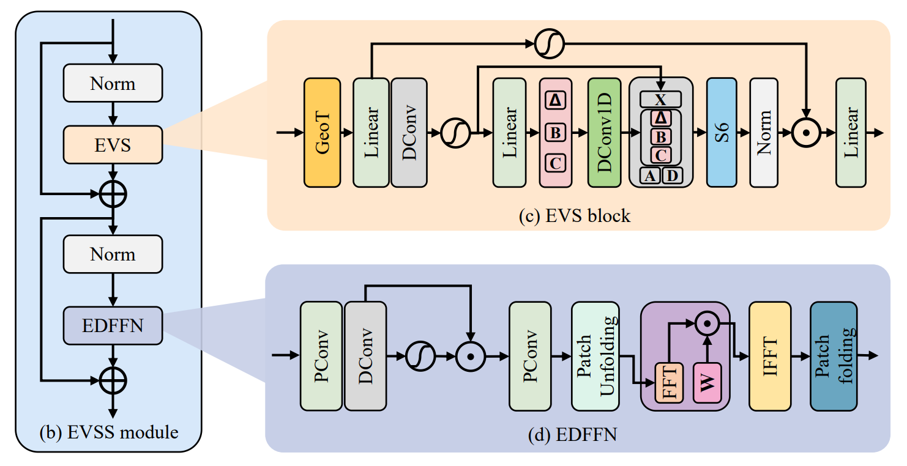
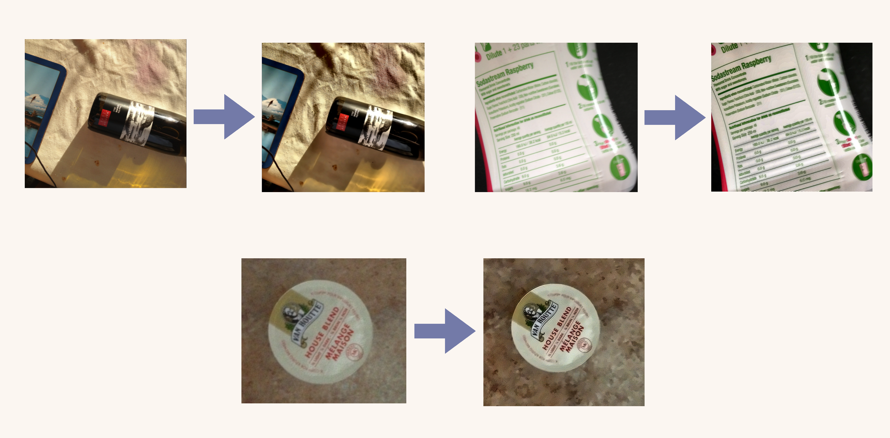

<h1 align="center">Voice-Driven VQA Web Assistant for Impaired Users <br> with Image Deblurring</h1>

<p align="center">
  An accessible, voice-first Visual Question Answering app.
  Point a camera, ask a question out loud, and hear the answer,
  with an optional motion-deblurring stage that keeps the model honest on real, blurry photos.
</p>

## Overview

For a sighted person, reading a label is a quick glance. For a blind or low-vision person it is a real problem, and VQA can help: take a photo, ask a spoken question, get a spoken answer.

In practice the reasoning model is rarely the hard part. The hard part is everything around it:

* A blind user cannot read the screen to start the app or to know when an answer is ready.
* They cannot frame a shot, so captures are often blurry, off-center, and shaky.
* When a model meets a blurry label it rarely refuses. It answers anyway and often invents a brand name, a dosage, or an expiry date. In an assistive setting a confident wrong answer is dangerous.

This project is built around the user, not around the model. The reasoning core (**Gemini 2.0 Flash**) is one stage of a short pipeline. The main work is the accessible assistant wrapped around it, plus an optional deblurring stage that keeps the model honest.

## Features

* Spoken onboarding. The intro is read aloud as soon as the user interacts with the page.
* Hands-free entry. A single keypress (space bar) acts as the Enter button.
* Capture two ways. Live webcam capture or image upload.
* Two answers at once. One Analyze press returns a detailed answer and a short answer.
* Automatic, announced speech. Every answer is read aloud, with a spoken status so a non-visual user knows the system state.
* Built-in evaluation view. Shows the question, an expert reference answer, and the model answer side by side.
* Graceful fallback. If the deblurring stage is unavailable, the app falls back to plain VQA instead of breaking.

## How It Works

A captured or uploaded image runs through a short pipeline and comes back as speech:

```
1. Capture        camera or upload
2. Enhancement    EVSSM deblurring (optional, falls back to pass-through)
3. Reasoning      Gemini 2.0 Flash (one long prompt, one short prompt)
4. Speech output  Web Speech API (text-to-speech with status)
```

Formally, let $I$ be the captured image and $q$ a user question. The optional enhancement decides which image the model actually sees:

$$
{\color{blue}
\tilde{I} =
\begin{cases}
D(I) & \text{if the enhancement is available} \\
I & \text{otherwise}
\end{cases}
}
$$

where $D(\cdot)$ is the EVSSM deblurring operator. The spoken answer is then produced by the multimodal model $M$:

$$
{\color{blue} a = M(\tilde{I}, q)}
$$

When $D$ is unavailable the pipeline degrades gracefully to plain VQA, $a = M(I, q)$. The reasoning core follows the standard VQA structure: a visual encoder $E_v$ and a question encoder $E_q$ are combined, and an answer is selected from the answer space $\mathcal{A}$:

$$
{\color{blue} a = \arg\max_{a' \in \mathcal{A}} P\big(a' \mid E_v(\tilde{I}), E_q(q)\big)}
$$

### The two prompts

For each image the assistant sends two requests, one long and one short, using templates $p_{\text{long}}$ and $p_{\text{short}}$:

$$
{\color{blue}
\big(a_{\text{long}}, a_{\text{short}}\big) =
\big(M(\tilde{I}, p_{\text{long}}(q)), M(\tilde{I}, p_{\text{short}}(q))\big)
}
$$

| Prompt | Template |
| --- | --- |
| Long | `Question: {q}. Provide a detailed answer. If blurry or unclear, please still try your best to answer.` |
| Short | `Question: {q}. Provide a short and simple answer in 1-2 sentences.` |

The "try your best" clause keeps the model answering even on imperfect images. The deblurring stage works in the same direction by making unclear inputs rarer.

## Deblurring: Why EVSSM and Not Super-Resolution

We first tried Real-ESRGAN (super-resolution) and found it unsatisfactory for this task. It removes noise well but treats motion blur as detail to keep, so unreadable text stays unreadable. The right tool is a motion-specific deblurring model.

EVSSM is a state-space model. Its core is a linear recurrence over the flattened sequence of $N$ image tokens:

$$
{\color{blue} h_t = \mathbf{A}\,h_{t-1} + \mathbf{B}\,x_t, \qquad y_t = \mathbf{C}\,h_t}
$$

This lets each output depend on all earlier positions while touching every token only once, so the cost grows linearly with the number of pixels instead of quadratically like attention:

$$
{\color{blue}
\mathcal{O}_{\text{SSM}}(N) = \mathcal{O}(N)
\qquad \text{vs} \qquad
\mathcal{O}_{\text{attn}}(N) = \mathcal{O}(N^2)
}
$$

That linear cost is what lets the restorer sit inside an interactive loop. The measured speed-up over the super-resolution baseline is:

$$
{\color{blue}
\text{speed-up} = \frac{T_{\text{SR}}}{T_{\text{EVSSM}}}
\approx \frac{1.0\,\text{s}}{89\,\text{ms}} \approx 11\times
}
$$

<p align="center">
  
</p>
<p align="center"><i>The EVSS module: an EVS block that captures long-range pixel dependencies to model blur, and an EDFFN block that refines frequency-domain features for sharper edges.</i></p>

### Comparison

| Aspect | Real-ESRGAN | EVSSM |
| --- | --- | --- |
| Primary target | Noise / JPEG artifacts | Dynamic motion blur |
| VQA legibility | Marginal gain | Clear gain |
| Latency (GPU) | about 1.0 s | about 89 ms (around 11x faster) |

## Results

Tested on real VizWiz photographs, after deblurring the smeared text becomes legible and the model stops inventing packaging text. The most consistent gains were on small printed text and small handheld objects, which are the cases that matter most for blind users.

<p align="center">
  
</p>
<p align="center"><i>Left to right within each pair: blurred input then deblurred output. A wine bottle, a drink concentrate label, and a coffee pod lid. Blurred labels and small text become legible.</i></p>

Note on results: the answer-quality gain is qualitative. We observed a clear drop in made-up text but did not compute a formal accuracy score against ground truth. A scored on-versus-off comparison on VizWiz is the next step.

## Installation

Requires a **CUDA**-capable GPU for EVSSM. A **Gemini API** key is required for the reasoning stage.

This project depends on Mamba (the `mamba-ssm` state-space library used by EVSSM), which needs a **CUDA** GPU and a matching PyTorch build. Install it through the provided conda/mamba environment rather than by hand.

```bash
# 1. Clone
git clone https://github.com/Neldaaa/VQA-Project.git
cd VQA-Project

# 2. Create the environment (defined in environment.yml)
mamba env create -f environment.yml
mamba activate <env-name>      # use the name set in environment.yml

# 3. Install remaining Python packages
pip install -r requirements.txt

# 4. Verify the environment (CUDA, mamba-ssm, packages)
python check_envs.py

# 5. Set the Gemini API key
export GEMINI_API_KEY="your_api_key_here"
```

If `mamba-ssm` fails to build, confirm that your **CUDA** toolkit and the installed PyTorch **CUDA** version match. EVSSM will not run without it; the app still works in plain VQA mode in that case.

## Project Structure

```
VQA-PROJECT/
├── app.py                     # Gradio web assistant (UI, onboarding, speech)
├── vqa_evssm_integration.py   # Connects the deblurring stage to the VQA pipeline
├── test_integration.py        # Checks the integration
├── check_envs.py              # Verifies the environment (CUDA, mamba-ssm, packages)
├── models/EVSSM.py            # Deblurring model
├── pipeline/                  # Image download + deblurring scripts and data
├── utils/image_processor.py   # Shared image handling
├── configs/                   # Deblur / EVSSM configs
└── data/                      # Evaluation set (expert reference + per-model answers)
```

## Data

* GoPro (training). Used to train the EVSSM core on high-resolution sharp/blurry pairs (500 training pairs, high-quality motion blur simulation).
* VizWiz (evaluation). Real photographs from blind users, with unpredictable blur and poor lighting. The prototype was tested end-to-end on 150 real blurry images.

The `data/` folder holds the evaluation set used by the built-in evaluation view. `expert.json` is the expert reference answer. The model-named files (`gemini.json`, `gpt-4v.json`, `llava.json`, `qwen.json`, `blip2.json`, `instruct_blip.json`) store answers from different vision-language models, and `all.json` aggregates them.

## Limitations

* Results are qualitative so far. A scored accuracy comparison (enhancement on versus off) is the obvious next measurement, and the evaluation view is already built for it.
* Speech uses the browser's available voices, so the exact voice varies by platform.
* The 89 ms figure is the local EVSSM cost. Total response time also includes the network round-trip to the hosted reasoning model.

## Authors

Jane (1123512), Katrina (1123521), Nelda (1123564). International Bachelor Program in Informatics, Yuan Ze University, Taoyuan, Taiwan.

## License

MIT License.
